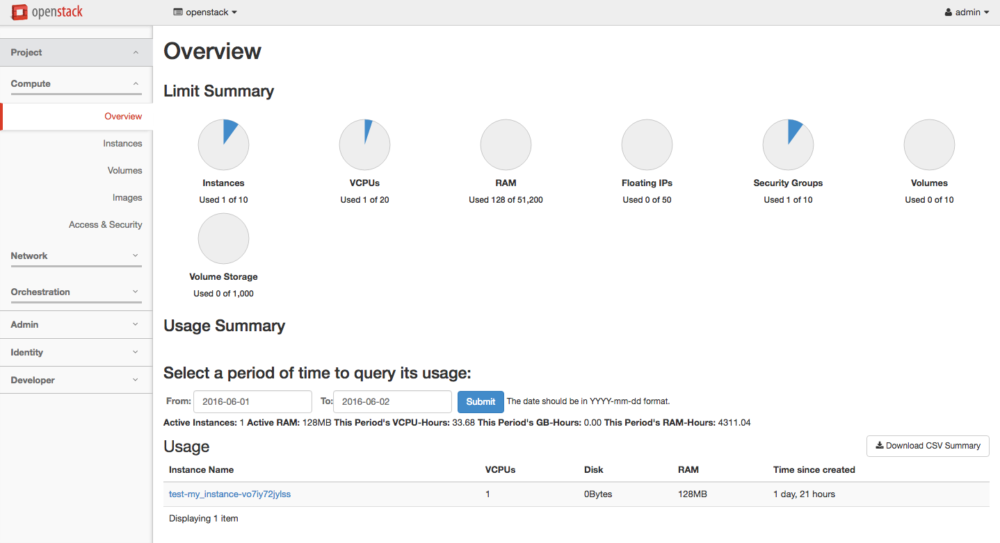

# puppet-horizon
0. [基础知识 - 快速了解Horizon](#基础知识)
1. [先睹为快 - 一言不合，立马动手?](#先睹为快)
2. [核心代码讲解 - 如何做到管理horizon服务？](#核心代码讲解)
   - [class horizon](###class horizon)
   - [class horzion::wsgi::apache](###class horizon::wsgi::apache)
3. [小结](##小结)
4. [动手练习 - 光看不练假把式](##动手练习)

**本节作者：余兴超**    

**建议阅读时间 40m**

## 基础知识

这是读者和作者都会感到轻松又欢快的一章，因为puppet-horizon模块比较简单...
回到正题，Horizon为用户提供了Web图形化的管理界面来完成一些常见的运维操作，例如创建虚拟机实例，管理网络，设置访问权限等等。下图给出了Horizon的预览页面的样例。



而puppet-horizon模块则是用来配置和管理horzion服务，包括horzion软件包，配置文件和服务的管理，在生产环境下，horizon将运行在Apache上，而不是运行在horizon开发服务器上。
除了四大核心项目以外，horizon还支持以下项目：

* swift
* cinder
* heat
* ceilometer
* trove
* sahara

> 注：要正常运行horizon服务，至少需安装Nova,Keystone,Glance,Neutron服务

## 先睹为快

```puppet
puppet apply -e 'class {'horizon': secret_key => 'big'}'
```

在puppet执行结束后，horizon就部署完成，并运行在Apache上了。

## 核心代码讲解

### class horizon

horizon类做了以下三件事情

- 完成了horizon软件包的安装:

```puppet
  package { 'horizon':
    ensure => $package_ensure,
    name   => $::horizon::params::package_name,
    tag    => ['openstack', 'horizon-package'],
  }
```

- horizon配置文件的管理:

```puppet
  concat { $::horizon::params::config_file:
    mode    => '0644',
    require => Package['horizon'],
  }

  concat::fragment { 'local_settings.py':
    target  => $::horizon::params::config_file,
    content => template($local_settings_template),
    order   => '50',
  }
```

这里稍微一提concat这种管理配置文件的方式，因为在其他模块里，我们已经看到这种管理配置文件的方式了，而它曾经流行过一段时间。

了解过template的同学都知道，这是puppet管理配置文件的内置方式，这种方式的优缺点非常明显，其缺点就是每次配置文件发生新的变动，那么模板也得保持同步的更新。

因此，有人就提出来，我们把模板给拆成一个个分片(fragment)，把基本保持不变化的代码放在xx1中，把经常变化分为一类的放到xx2中，然后最后再拼接起来(concat)。所以就有了上面这段代码的来历。

为什么后来它不流行了呢？参见我的博客：[Openstack配置文件管理的变迁之路](http://www.cnblogs.com/yuxc/p/3650660.html)

- 接着往下，管理horizon服务并运行在Apache上:

```puppet
  if $configure_apache {
    class { '::horizon::wsgi::apache':
      bind_address   => $bind_address,
      servername     => $servername,
      server_aliases => $final_server_aliases,
      listen_ssl     => $listen_ssl,
      ssl_redirect   => $ssl_redirect,
      horizon_cert   => $horizon_cert,
      horizon_key    => $horizon_key,
      horizon_ca     => $horizon_ca,
      extra_params   => $vhost_extra_params,
      redirect_type  => $redirect_type,
      root_url       => $root_url
    }
  }
```

这个类中没什么特别重要的类，值得一提的是几个比较重要的参数：

- keystone_url
- available_regions
- cache_server_ip
- secret_key

还有一个是函数member的使用，类似于python中的in，用于判断一个变量是否存在于一个list中，list在左，变量在右边：

```puppet
 if ! (member($tuskar_ui_deployment_mode_allowed_values, $tuskar_ui_deployment_mode)) {
    fail("'${$tuskar_ui_deployment_mode}' is not correct value for tuskar_ui_deployment_mode parameter. It must be either 'scale' or 'poc'.")
  }
```


## class horizon::wsgi::apache

和其他模块相同后缀名的类一样，用于配置将horizon运行在apache上。

这里值得一提的有两点，第一点是merge函数：

```puppet
  if $bind_address {
    $default_vhost_conf = merge($default_vhost_conf_no_ip, { ip => $bind_address }) #将两个或两个以上的hash变量合并成一个hash变量
  } else {
    $default_vhost_conf = $default_vhost_conf_no_ip
  }
```

第二点是仍然是函数ensure_resource:

```puppet
  ensure_resource('apache::vhost', $vhost_conf_name, merge ($default_vhost_conf, $extra_params, {
    redirectmatch_regexp => $redirect_match,
    redirectmatch_dest   => $redirect_url,
  }))
```

其等价于:

```puppet
 $merged_hash_list = merge ($default_vhost_conf, $extra_params, {
    redirectmatch_regexp => $redirect_match,
    redirectmatch_dest   => $redirect_url,
  })
 apache::vhost {"$vhost_conf_name":
    $merged_hash_list
  }))
```
这么写的主要原因是为了代码简洁。

## 小结

   这章的内容比较简单，因此我们介绍了像concat,merge,ensure_resource这些define和function，它们的加入使得代码逻辑变得更加强大。

## 动手练习

1. 开启Horizon SSL端口
2. 确保Horizon服务只监听在内网IP上
3. 如何调整mod_wsgi的参数来设置Horizon运行在三种不同的MPM模式：prefork, worker, winnt
