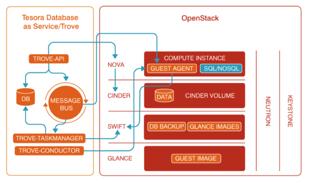

# puppet-trove

0. [基础知识 - 快速了解 trove 服务 ](##基础知识)
1. [先睹为快 - 一言不合，立马动手?](##先睹为快)
2. [核心代码讲解 - 如何管理 trove 服务？](##核心代码讲解)
    - [class trove](###class trove)
    - [class trove::api](###class trove::api)
    - [class trove::conductor](###class trove::conductor)
    - [class trove::taskmanager](###class trove::taskmanager)
3. [小结](#小结)
4. [动手练习](##动手练习)

**本节作者：廖鹏辉**    

**阅读时间:2h**

##基础知识

trove 是一个 DBaaS 服务，它能够利用 OpenStack 云平台中的资源，让用户能够以自助的方式快速的构建和管理数据库服务。trove 支持多种数据库，包括关系型和非关系型数据库，例如 MySQL/MariaDB/PostgreSQL/MongoDB/Canssandra/Redis/Couchbase 等等。trove 将这些数据库的管理功能抽象成了统一的接口提供给用户使用。

使用 trove 服务能够帮助用户减少数据库的部署，配置和维护成本，能够更轻松的使用各种不同的数据库服务。trove 通过调用 Nova/Cinder/Swift 等其他 OpenStack 服务来进行资源的编排。

trove 服务有下面这些组件：

- trove-api，对外提供 REST-ful 的 API
- trove-taskmanager，监听在消息队列上，负责完成虚拟机实例的启动，以及实例的整个生命周期的管理，并对数据库进行管理操作
- trove-guestagent，运行在虚拟机实例内部，监听在消息队列上，负责对数据库进行管理的运维操作
- trove-conductor，接收虚拟机示例发送的信息，并更新各个实例的状态，它的作用类似于 nova-conductor

这些组件之间以及与其他 OpenStack 服务之间的关系如下：



## 先睹为快

部署 trove 服务需要依赖于其他的 OpenStack 组件，因此建议先部署核心的 OpenStack 组件，最后部署 trove 服务。可以使用 puppet-trove 模块的示例代码来部署 trove 服务：

```bash
puppet apply trove/examples/site.pp
```

代码中使用 `trove::client` 来部署客户端组件，使用 `::trove::api`/`::trove::conductor`/`::trove::taskmanager` 来部署 trove 的各个服务。使用 `::trove::keystone::auth` 类来完成 keystone 相关资源的创建，使用 `::trove::db::mysql` 来完成数据库的创建。

### class trove

trove 这个类用于安装 openstack-trove 基础包，同时使用 trove_config 资源对 trove 进行基础配置（例如 nova/neutron/cinder 等服务的访问 URL），并且定义了一些消息队列，数据库相关的参数，供各个服务使用。

例如，下面的代码使用 trove_config 配置了 nova 的访问 URL：

```bash
  if $nova_compute_url {
    trove_config { 'DEFAULT/nova_compute_url': value => $nova_compute_url }
  }
  else {
    trove_config { 'DEFAULT/nova_compute_url': ensure => absent }
  }
```

### class trove::api
由于众多 OpenStack 模块都使用 oslo 公共库，这些服务都需要进行 oslo 相关的配置，这些配置在 trove 模块中被抽象成为单独的类，来进行响应的配置，`trove::db` 用于 oslo.db 相关的配置，`trove::logging` 用于 oslo.log 相关的配置

`trove::api` 中，调用了 `trove::db` 来进行数据库配置，调用 `trove::logging` 来进行日志相关的配置。

`trove::api` 还使用了 `puppet-oslo` 模块中的 define 资源来进行 oslo 相关的配置，例如，进行 MQ 相关的配置：

```bash
    oslo::messaging::rabbit {'trove_config':
      rabbit_hosts          => $::trove::rabbit_hosts,
      rabbit_host           => $::trove::rabbit_host,
      rabbit_port           => $::trove::rabbit_port,
      rabbit_ha_queues      => $::trove::rabbit_ha_queues,
      rabbit_userid         => $::trove::rabbit_userid,
      rabbit_password       => $::trove::rabbit_password,
      rabbit_virtual_host   => $::trove::rabbit_virtual_host,
      rabbit_use_ssl        => $::trove::rabbit_use_ssl,
      kombu_reconnect_delay => $::trove::kombu_reconnect_delay,
      amqp_durable_queues   => $::trove::amqp_durable_queues,
      kombu_ssl_ca_certs    => $::trove::kombu_ssl_ca_certs,
      kombu_ssl_certfile    => $::trove::kombu_ssl_certfile,
      kombu_ssl_keyfile     => $::trove::kombu_ssl_keyfile,
      kombu_ssl_version     => $::trove::kombu_ssl_version
    }
```

关于 puppet-oslo 模块相关的细节可以参考本书对 puppet-oslo 模块的介绍。这里值得注意的是在代码中直接调用了 `trove` 这个类中的变量使用，为什么 `trove::api` 能够使用 `trove` 类中的变量呢，这时因为 `trove::api` 使用 inherits 继承了 `trove` 类，关于 inherits 的用法，可以参考[这里](https://docs.puppet.com/puppet/3.8/reference/lang_classes.html#inheritance)。

### class trove::conductor
trove-conductor 服务的部署也比较简单，和 trove-api 类似，配置一些基础配置和 oslo 相关配置，就可以启动服务了，在 puppet-trove 模块总，服务的管理都是使用 `trove::generic_service` 这个 define 资源来完成的，例如， trove-conductor 服务的使用：

```bash
  trove::generic_service { 'conductor':
    enabled        => $enabled,
    manage_service => $manage_service,
    package_name   => $::trove::params::conductor_package_name,
    service_name   => $::trove::params::conductor_service_name,
    ensure_package => $ensure_package,
  }
```

### class trove::taskmanager
trove-taskmanager 服务的部署和 trove 其他服务也是类似的，唯一需要注意的是 trove-taskmanager 类中也对 guest-agent 的配置文件进行了管理，管理使用的是模板的方式：

```
  file { $guestagent_config_file:
    content => template('trove/trove-guestagent.conf.erb'),
    require => Anchor['trove::install::end'],
  }
```

##小结
trove 服务的部署比较简单，使用 puppet 能够方便的部署起 trove 服务起来，如果想进一步学习 trove 服务的使用，可以参考 openstack 官方的文档。

##动手练习
- 部署 trove 服务，制作一个基于 mysql 的镜像，并导入到 trove 中
- 使用 mysql 镜像启动数据库实例


