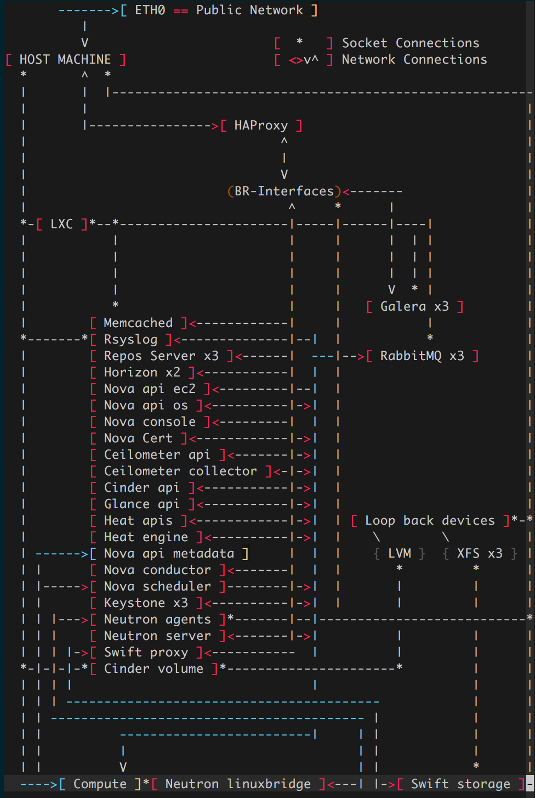

# Openstack-Ansible
## OSA简介
***
OpenStack-Ansible 是 OpenStack 社区的官方项目，可以部署在指定物理机器上，而不使用容器技术，从而可以更加容易的去的运维、升级、及扩展集群。同时OpenStack-Ansible（OSA）使用Ansible 自动化工具在Ubuntu Linux上部署OpenStack集群。为了隔离和易于维护，OSA也可以使用Linux容器（LXC）将Openstack核心服务安装到容器当中。除了OSA社区中官方项目Kolla，它的原理基于容器作为服务载体，使用Docker技术，如果有兴趣读者可以阅读Kolla章节。

* 注意了解本章需要你有一定的 Ansible 和 OpenStack的基本概念。本次我们通过一个 OpenStack-Ansible部署一套AIO环境
***

## Ansible
Ansible是目前市面上非常流行一个自动化工具，主要是为了简化系统和应用程序的部署。Ansible通过SSH技术链接到每台服务器上。Ansible使用以YAML语言编写的手册进行编排。

## Linux containers (LXC)
Linux Container容器是一种内核虚拟化技术。容器通过增强chroot环境的概念提供操作系统级虚拟化。容器为特定的一组进程隔离资源和文件系统，而没有虚拟机的开销和复杂性。们访问底层主机上的相同内核，设备和文件系统，并提供围绕一组规则构建的精简操作层。


## OSA可配置的组件
可以部署Infrastructure 组件包括
* MariaDB with Galera
* RabbitMQ
* Memcached
* Repository
* Load balancer
* Utility container
* Log aggregation host
* Unbound DNS container

可以部署的Openstack组件包括
OpenStack services
* Bare Metal (ironic)
* Block Storage (cinder)
* Compute (nova)
* Container Infrastructure Management (magnum)
* Dashboard (horizon)
* Data Processing (sahara)
* Identity (keystone)
* Image (glance)
* Networking (neutron)
* Object Storage (swift)
* Orchestration (heat)
* Telemetry (aodh, ceilometer, gnocchi)

## OSA 安装Openstack
***
环境准备,需要准备如下配置：
*8 vCPU’s
*50GB free disk space on the root partition
*8GB RAM
***

最小化配置需求：
* CPU主板支持hardware-assisted的虚拟化
* 8 CPU Cores
* 80GB的主分区，或者60GB的第二块分区。（如果使用第二块分区需要使用bootstrap_host_data_disk_device参数）。更多的细节可以去看如下链接：

官方建议配置：
* CPU主板支持hardware-assisted的虚拟化
* 8 CPU Cores
* 80GB的主分区，或者60GB的第二块分区。（如果使用第二块分区需要使用bootstrap_host_data_disk_device参数）。更多的细节可以去看如下链接：
* 16GB RAM
* 参考文献：http://docs.openstack.org/developer/openstack-ansible/developer-docs/quickstart-aio.html


开始构建AIO环境
通过OpenStack-Ansible部署一套AIO环境有四步曲，但是第一步是可选项，此步骤需要你自己完成。
* 环境配置
* 安装bootstrap和Ansible
* 初始化主机的bootstrap
* 运行Playbook

注意：当部署一套新的集群时，我们建议将当前机器的内核及软件包升级到最新的版本。并且如下的命令都是通过Root用户来运行。可以在虚拟机中执行AIO构建以进行演示和评估，但是虚拟机性能会很差。对于生产环境中建议为特定角色使用多节点方式。

本次部署环境使用Ubuntu 14.04 LTS，Ansible 版本为2.2.0，首先在节点所有将Package 更新
```bash
$ sudo apt-get dist-upgrade
```

git clone最新版本的openstack-ansible
```bash
$ sudo su -
$ git clone https://github.com/openstack/openstack-ansible
$ cd /opt/openstack-ansible
```

根据自己需求来部署对应的Openstack集群版本
```bash
# # 显示所有的TAG号
# git tag -l

# # 本次我们使用Newton版本搭建一套AIO
# git checkout stable/newton
# git describe --abbrev=0 --tags

# # Checkout the latest tag from either method of retrieving the tag.
# git checkout 15.0.0.0rc1
```

设定参数在部署过程中会使用
```bash
export BOOTSTRAP_OPTS="bootstrap_host_data_disk_device=vdb"
export ANSIBLE_ROLE_FETCH_MODE=git-clone
```
环境执行工具的安装和初始化
```bash
$ scripts/bootstrap-ansible.sh
```
执行命令环境准备
```bash
$ scripts/bootstrap-aio.sh
```
最后执行部署命令
```bash
$ scripts/run-playbooks.sh
```

安装过程需要一段时间才能完成，但这里有一些一般估计：
* 带SSD存储的裸机系统：30-50分钟
* 具有SSD存储的虚拟机：约45-60分钟
* 系统与传统硬盘：90-120分钟


一旦playbook完全执行，可以尝试在/etc/openstack_deploy/user_variables.yml中的各种设置更改，并且只运行单个剧本。例如，要运行Keystone服务的剧本，请执行
```bash
# cd /opt/openstack-ansible/playbooks
# openstack-ansible os-keystone-install.yml
```

重新构建环境
有时，销毁所有容器并重建AIO是最佳的方案。虽然最佳方案是AIO被完全破坏和重建，但这并不是最佳的方案。因此，可以执行以下操作
```bash
# cd /opt/openstack-ansible/playbooks

# 删除所有的LXC容器
# openstack-ansible lxc-containers-destroy.yml

# # On the host stop all of the services that run locally and not
# #  within a container.
# for i in \
       $(ls /etc/init \
         | grep -e "nova\|swift\|neutron\|cinder" \
         | awk -F'.' '{print $1}'); do \
    service $i stop; \
  done

# # 卸除所有已经安装的Openstack服务
# for i in $(pip freeze | grep -e "nova\|neutron\|keystone\|swift\|cinder"); do \
    pip uninstall -y $i; done

# # 删除日志和配置目录
# rm -rf /openstack /etc/{neutron,nova,swift,cinder} \
         /var/log/{neutron,nova,swift,cinder}

# # 删除pip配置文件
# rm -rf /root/.pip

# # 删除apt的proxy配置文件
# rm /etc/apt/apt.conf.d/00apt-cacher-proxy
```

### OSA部署流程

### OSA的AIO工作流程图


### OpenStack-ansible配置管理
OSA将安装服务文件存放在/etc/openstack_deploy/conf.d/目录当中，提供AIO和example展示当前主机组使用的文件。如果需要添加其它服务，分配主机到当前的主机文件当中，最后执行playbooks。

```bash
# 执行命令
# openstack-ansible setup-infrastructure.yml
```
setup-infrastructure.yml 文件包含了如下yaml
```bash
- include: unbound-install.yml
- include: repo-install.yml
- include: haproxy-install.yml
- include: memcached-install.yml
- include: galera-install.yml
- include: rabbitmq-install.yml
- include: etcd-install.yml
- include: ceph-install.yml
- include: utility-install.yml
- include: rsyslog-install.yml
```
Ansible 基础服务的playbooks安装如下基础服务：Memcached repository Galera RabbitMQ rsyslog
memcached-install.yaml 详细代码，主要由两个role组成
```bash
- name: Install memcached
  hosts: memcached
  gather_facts: "{{ gather_facts | default(True) }}"
  max_fail_percentage: 20
  user: root
  pre_tasks:
    - include: common-tasks/os-lxc-container-setup.yml
    - include: common-tasks/os-log-dir-setup.yml
      vars:
        log_dirs:
          - src: "/openstack/log/{{ inventory_hostname }}-memcached"
            dest: "/var/log/memcached"
    - include: common-tasks/package-cache-proxy.yml
  roles:
    - role: "memcached_server"
    - role: "rsyslog_client"
      rsyslog_client_log_rotate_file: memcached_log_rotate
      rsyslog_client_log_dir: "/var/log/memcached"
      rsyslog_client_config_name: "99-memcached-rsyslog-client.conf"
      tags:
        - rsyslog
    - role: "system_crontab_coordination"
      tags:
        - crontab
  vars:
    is_metal: "{{ properties.is_metal|default(false) }}"
  tags:
    - memcached
```
role: "memcached_server" 默认参数
```bash
## Logging level
debug: False

## APT Cache Options
cache_timeout: 600

# Set the package install state for distribution packages
# Options are 'present' and 'latest'
memcached_package_state: "latest"

# Defines that the role will be deployed on a host machine
is_metal: true

# The default memcache memory setting is to use .25 of the available system ram
# as long as that value is < 8192. However you can set the `memcached_memory`
# value to whatever you like as an override.
base_memcached_memory: "{{ ansible_memtotal_mb | default(4096) }}"
memcached_memory: "{{ base_memcached_memory | int // 4 if base_memcached_memory | int // 4 < 8192 else 8192 }}"

memcached_port: 11211
memcached_listen: "127.0.0.1"
memcached_log: /var/log/memcached/memcached.log
memcached_connections: 1024
memcached_threads: 4
memcached_file_limits: "{{ memcached_connections | int + 1024 }}"

memcached_distro_packages: []
memcached_test_distro_packages: []
install_test_packages: False
```
更多参数可以参考:https://github.com/openstack/openstack-ansible-memcached_server
### 其它
安装前检查命令
```bash
openstack-ansible setup-hosts.yml --syntax-check
openstack-ansible setup-infrastructure.yml --syntax-check
openstack-ansible setup-openstack.yml --syntax-check
```
## 总结
优点
* 部署简单
* 支持的部署的服务多
* 可以自定义role中参数

缺点
* 友好程度
